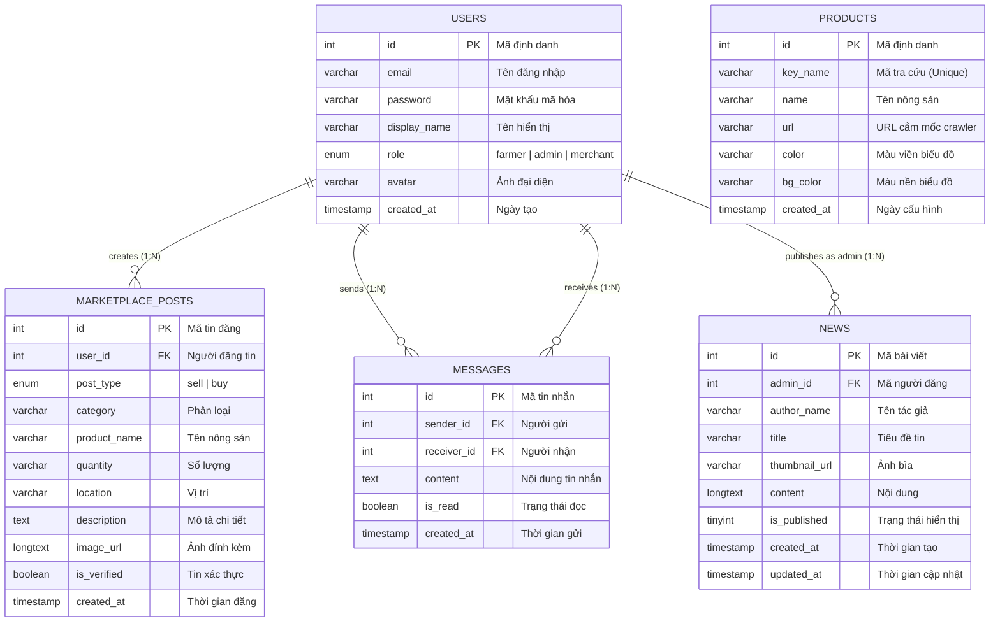

# BÁO CÁO BÀI TẬP LỚN: HỆ SINH THÁI NÔNG NGHIỆP SỔ TAY NÔNG DÂN SỐ (AGRIKNOWLEDGE WEB)

## 1. Giới thiệu Đề tài
**AgriKnowledge Web (Sổ Tay Nông Dân Số)** là một ứng dụng Web (SaaS) được xây dựng nhằm hỗ trợ cộng đồng nông dân và thương lái trong việc theo dõi thời tiết tự động theo vùng canh tác, cập nhật biến động giá nông sản theo thời gian thực (crawler), đọc tin tức chuyên ngành, và đặc biệt là hệ thống Giao thương (Marketplace) cho phép đăng tin mua bán, kết nối và nhắn tin trực tiếp.

Ứng dụng được thiết kế theo mô hình **Client - Server**, chia quyền rõ ràng giữa Người dùng (Nông dân/Thương lái) và Quản trị viên (Admin).

---

## 2. Kiến trúc Hệ thống
Mô hình hoạt động của dự án tuân theo chuẩn RESTful API với kiến trúc phân lớp:

```text
[ Trình duyệt Client ] (HTML/CSS/Vanilla JS)
          |
   (HTTP/REST API)
          |
[ Express Server ] (Node.js backend)  ---> [ Price Crawler Service (Axios + Cheerio) ]
          |
[ Cơ sở dữ liệu ] (MySQL)
```

**Công nghệ sử dụng (Tech Stack):**
- **Frontend:** HTML5, CSS3 (Custom CSS Framework), Vanilla JavaScript. Giao diện được thiết kế hiện đại (SaaS UI/UX) hoàn toàn responsive.
- **Backend:** Node.js, Express.js.
- **Cơ sở dữ liệu:** MySQL (Sử dụng module `mysql2` để kết nối, tự động tạo database và table nếu chưa tồn tại).
- **Công cụ hỗ trợ:** Axios & Cheerio (Cào dữ liệu web tự động), JWT (Xác thực người dùng), Bcrypt (Mã hóa mật khẩu).

---

## 3. Cấu trúc Dự án (Directory Structure)

```text
AgriKnowledge_Web/
├── backend/                  # Mã nguồn Backend API Server
│   ├── src/
│   │   ├── config/           # Cấu hình Database & Environment
│   │   ├── controllers/      # Chứa logic xử lý của từng API
│   │   ├── middleware/       # Middleware xác thực JWT (Auth)
│   │   ├── routes/           # Định nghĩa các Endpoints API
│   │   ├── services/         # Dịch vụ Crawler giá nông sản
│   │   ├── utils/            # Các hàm hỗ trợ (Parser)
│   │   └── server.js         # Entry point chính của backend
│   ├── .env.example          # File mẫu chứa biến môi trường
│   └── package.json          # Quản lý thư viện backend
├── public/                   # Thư mục Frontend (Static Files)
│   ├── css/style.css         # CSS Framework System
│   ├── js/                   # Vanilla JS xử lý logic client
│   ├── index.html            # Landing Page
│   ├── weather.html          # Tính năng Thời tiết
│   ├── market-price.html     # Tính năng Thị trường & Giá
│   ├── marketplace.html      # Sàn Giao thương
│   ├── news.html             # Tin tức nông nghiệp
│   ├── profile.html          # Hồ sơ cá nhân (Dùng chung)
│   └── admin-*.html          # Các trang quản lý dành cho Admin
└── README.md                 # Tài liệu Báo cáo
```

---

## 4. Các Tính Năng Nổi Bật

### 4.1. Phân hệ Người Dùng (Nông dân / Thương lái)
- **Xác thực & Phân quyền:** Đăng ký, Đăng nhập sử dụng JWT (JSON Web Tokens). Có thể tùy chỉnh hồ sơ cá nhân.
- **Thời tiết & Môi trường (`weather.html`):** Cho phép xem dự báo thời tiết và các thông số (độ ẩm, gió, mưa) tích hợp thời gian thực.
- **Thị trường & Giá (`market-price.html`):** Biểu đồ biến động giá nông sản được Crawler tự động từ các nguồn tin cậy, hỗ trợ so sánh giá nhiều loại nông sản.
- **Giao thương (`marketplace.html`):** Nơi người dùng có thể đăng tin Thu mua hoặc Chào bán. Tích hợp bộ lọc đa dạng và chức năng xác thực tin đăng.
- **Tin nhắn nội bộ (Messages):** Nhắn tin trực tiếp giữa người mua và người bán để thỏa thuận giá cả.
- **Tin tức Nông nghiệp (`news.html`):** Đọc các bài viết, kiến thức canh tác, thông tin thị trường mới nhất.

### 4.2. Phân hệ Quản trị viên (Admin)
- **Truy cập:** Quản trị viên sử dụng thanh điều hướng độc lập. Có tính năng "Giao diện Người dùng" để chuyển đổi nhanh sang luồng người dùng để kiểm thử.
- **Quản lý Nông dân (`admin-farmers.html`):** Xem, chỉnh sửa, cấp quyền và xóa tài khoản người dùng trên hệ thống.
- **Quản lý Nông sản (`admin-products.html`):** Thêm mới và cấu hình các loại nông sản, gán link cắm mốc (Crawler Target) để hệ thống tự động cào giá cập nhật vào biểu đồ.
- **Quản lý Tin tức (`admin-news.html`):** Đăng tải, chỉnh sửa, xóa bài viết chuyên đề nông nghiệp.
- **Quản lý Giao thương (`admin-marketplace.html`):** Kiểm duyệt, duyệt hoặc xóa tin đăng trên sàn giao thương để đảm bảo môi trường thương mại minh bạch.

---

## 5. Thiết kế Cơ sở dữ liệu (Database Schema)
Hệ thống sử dụng cơ sở dữ liệu quan hệ (MySQL) với 5 bảng cốt lõi (Tables), được tự động khởi tạo qua module cấu hình `db.js`.

### 5.1. Bảng `users` (Tài khoản người dùng)
Lưu trữ thông tin xác thực và hồ sơ của tất cả các tài khoản trên hệ thống.
| Cột | Kiểu dữ liệu | Khóa / Ràng buộc | Mô tả |
| :--- | :--- | :--- | :--- |
| `id` | INT | Primary Key, Auto Increment | Mã định danh người dùng |
| `email` | VARCHAR(255) | UNIQUE, NOT NULL | Tên đăng nhập (Email) |
| `password` | VARCHAR(255) | NOT NULL | Mật khẩu (đã được hash bcrypt) |
| `display_name` | VARCHAR(255) | Default: 'Người dùng mới' | Tên hiển thị trên hồ sơ |
| `role` | ENUM | 'farmer', 'admin', 'merchant' | Quyền hạn tài khoản |
| `avatar` | VARCHAR(500) | NULL | URL ảnh đại diện |
| `created_at` | TIMESTAMP | Default: CURRENT_TIMESTAMP | Ngày khởi tạo tài khoản |

### 5.2. Bảng `products` (Danh mục Nông sản & Crawler)
Quản lý các loại nông sản và lưu trữ cấu hình URL để công cụ Crawler tự động vào các trang web lấy giá thị trường.
| Cột | Kiểu dữ liệu | Khóa / Ràng buộc | Mô tả |
| :--- | :--- | :--- | :--- |
| `id` | INT | Primary Key, Auto Increment | Mã định danh nông sản |
| `key_name` | VARCHAR(50) | UNIQUE, NOT NULL | Mã tra cứu hệ thống (vd: 'lua') |
| `name` | VARCHAR(255) | NOT NULL | Tên nông sản hiển thị |
| `url` | VARCHAR(1024) | | URL mục tiêu để cào dữ liệu |
| `color` | VARCHAR(50) | Default: '#3b82f6' | Mã màu đường viền biểu đồ |
| `bg_color` | VARCHAR(50) | Default: 'rgba(...)' | Mã màu nền biểu đồ Chart.js |
| `created_at` | TIMESTAMP | Default: CURRENT_TIMESTAMP | Ngày thêm vào danh mục |

### 5.3. Bảng `news` (Tin tức Nông nghiệp)
Lưu trữ nội dung các bản tin, kiến thức chuyên môn do Admin biên soạn.
| Cột | Kiểu dữ liệu | Khóa / Ràng buộc | Mô tả |
| :--- | :--- | :--- | :--- |
| `id` | INT | Primary Key, Auto Increment | Mã định danh bài viết |
| `admin_id` | INT | | Mã Admin biên soạn |
| `author_name` | VARCHAR(255) | Default: 'Admin' | Tên tác giả |
| `title` | VARCHAR(500) | NOT NULL | Tiêu đề bài viết |
| `thumbnail_url` | VARCHAR(1024) | | URL ảnh bìa (thumbnail) |
| `content` | LONGTEXT | NOT NULL | Nội dung chi tiết (HTML/Text) |
| `is_published` | TINYINT(1) | Default: 1 (True) | Trạng thái hiển thị |
| `created_at` | TIMESTAMP | Default: CURRENT_TIMESTAMP | Thời điểm đăng bài |
| `updated_at` | TIMESTAMP | ON UPDATE CURRENT_TIMESTAMP | Cập nhật gần nhất |

### 5.4. Bảng `marketplace_posts` (Sàn Giao thương)
Lưu trữ các bài đăng có nhu cầu Mua hoặc Bán từ phía người nông dân và thương lái.
| Cột | Kiểu dữ liệu | Khóa / Ràng buộc | Mô tả |
| :--- | :--- | :--- | :--- |
| `id` | INT | Primary Key, Auto Increment | Mã định danh tin đăng |
| `user_id` | INT | Foreign Key -> `users(id)` | Mã người đăng tin (ON DELETE CASCADE) |
| `post_type` | ENUM | 'sell', 'buy' | Loại tin đăng (Cần mua/Cần bán) |
| `category` | VARCHAR(100) | | Phân loại (Trái cây, Ngũ cốc...) |
| `product_name` | VARCHAR(255) | NOT NULL | Tên nông sản giao dịch |
| `quantity` | VARCHAR(100) | | Số lượng / Khối lượng (vd: 50 Tấn) |
| `location` | VARCHAR(255) | | Khu vực / Tỉnh thành giao dịch |
| `description` | TEXT | | Mô tả chi tiết (Giá cả, chất lượng) |
| `image_url` | LONGTEXT | | URL ảnh minh họa nông sản |
| `is_verified` | BOOLEAN | Default: 0 (False) | Đánh dấu xác thực (Tin uy tín) |
| `created_at` | TIMESTAMP | Default: CURRENT_TIMESTAMP | Thời điểm đăng tin |

### 5.5. Bảng `messages` (Tin nhắn nội bộ)
Lưu trữ nội dung trò chuyện (chat) trực tiếp giữa người dùng (người mua - người bán) trên nền tảng.
| Cột | Kiểu dữ liệu | Khóa / Ràng buộc | Mô tả |
| :--- | :--- | :--- | :--- |
| `id` | INT | Primary Key, Auto Increment | Mã tin nhắn |
| `sender_id` | INT | Foreign Key -> `users(id)` | Mã người gửi |
| `receiver_id` | INT | Foreign Key -> `users(id)` | Mã người nhận |
| `content` | TEXT | NOT NULL | Nội dung tin nhắn |
| `is_read` | BOOLEAN | Default: 0 (False) | Đánh dấu đã đọc |
| `created_at` | TIMESTAMP | Default: CURRENT_TIMESTAMP | Thời điểm gửi tin |

### 5.6. Sơ đồ Thực thể Liên kết (ERD)

Sơ đồ ERD dưới đây mô tả trực quan các thực thể và mối quan hệ giữa chúng trong hệ thống Cơ sở dữ liệu:



---

## 6. Danh Sách API (RESTful Endpoints)
Base URL: `http://localhost:3000/api`

**Authentication**
- `POST /api/auth/register`
- `POST /api/auth/login`
- `PUT  /api/auth/profile`

**Public Data (Prices & News)**
- `GET /api/prices` (Crawler dữ liệu trả về mảng giá)
- `GET /api/news` (Lấy danh sách tin tức)
- `GET /api/news/:id`

**Marketplace & Messages**
- `GET, POST, PUT, DELETE /api/marketplace`
- `GET /api/messages/conversations`
- `POST /api/messages`

**Admin Resource Management**
- `GET, POST, PUT, DELETE /api/admin/products`
- `GET, POST, PUT, DELETE /api/admin/farmers`
- `GET, POST, PUT, DELETE /api/admin/news` (Via `news/admin/...`)

---

## 7. Hướng dẫn Cài đặt & Chạy Dự án

**Yêu cầu hệ thống:**
- Node.js (v18 trở lên)
- npm hoặc yarn
- MySQL Server (Có thể sử dụng XAMPP/WAMP để khởi chạy dịch vụ MySQL)

**Bước 1: Cài đặt thư viện**
Di chuyển vào thư mục backend và cài đặt:
```bash
cd backend
npm install
```

**Bước 2: Cấu hình Môi trường**
Tạo file `.env` trong thư mục `backend/` dựa trên `.env.example`:
```env
DB_HOST=localhost
DB_USER=root
DB_PASSWORD=            # Mật khẩu MySQL (để trống nếu dùng XAMPP mặc định)
DB_NAME=agriknowledge
DB_PORT=3306
JWT_SECRET=super_secret_key_for_jwt
PORT=3000
```

**Bước 3: Khởi chạy Server**
Hệ thống được lập trình để tự động tạo Database (`agriknowledge`) và các Tables (bảng) khi chạy lần đầu:
```bash
npm start
```
*Ghi chú: Bạn cũng có thể dùng `node src/server.js` từ thư mục backend.*

**Bước 4: Sử dụng Ứng dụng**
Mở trình duyệt và truy cập đường dẫn:
```text
http://localhost:3000
```

---
*Báo cáo được hoàn thiện dựa trên quá trình xây dựng thực tế của dự án.*
